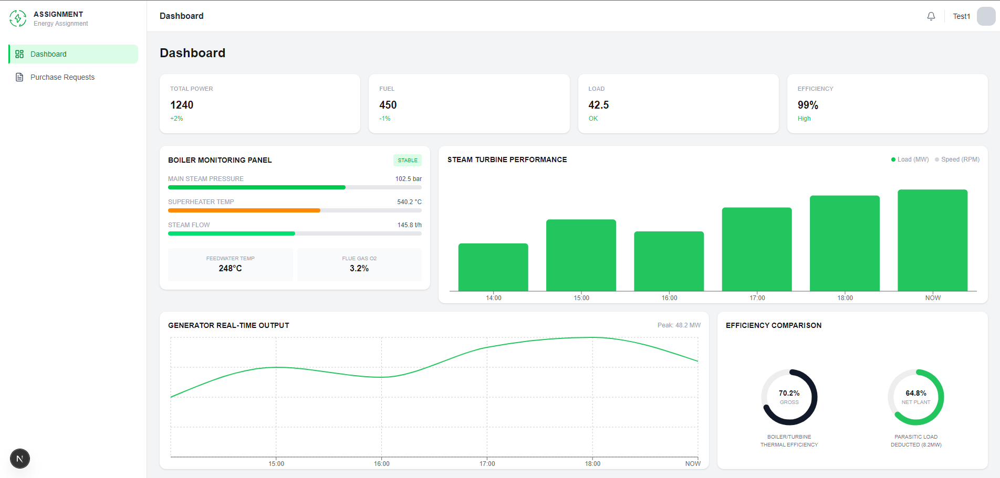
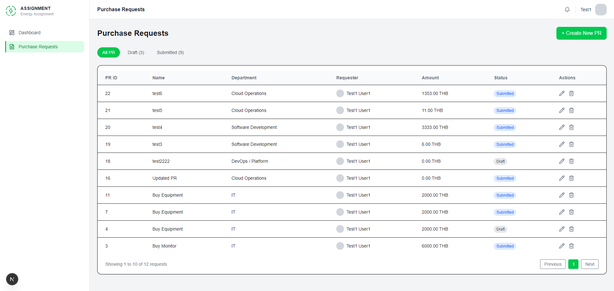
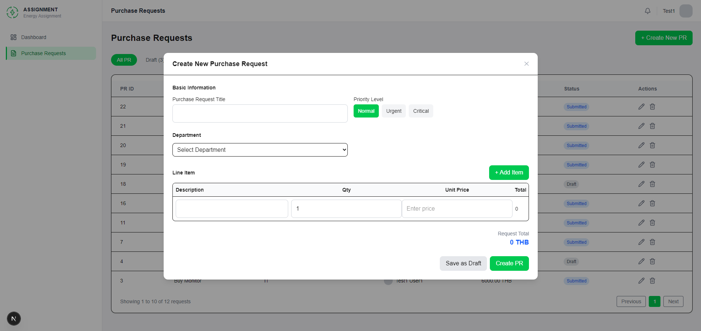

# 🚀 PR Dashboard (Fullstack Practice)

A **Purchase Request (PR) management system** built to simulate a real-world business workflow.

This project started as a **frontend-focused application** and was later extended into a fullstack system to explore backend development, API design, and database relationships.

Built with **Next.js, NestJS, and PostgreSQL**, featuring JWT authentication, protected routes, full CRUD operations, and API documentation with Swagger.

---

## 🛠 Tech Stack

### 🎨 Frontend

* Next.js (App Router)
* TypeScript
* Tailwind CSS

### ⚙️ Backend

* NestJS
* PostgreSQL
* JWT Authentication
* Swagger (API Documentation)

---

## ✨ Features

### 🔐 Authentication

* Login with JWT
* Protected routes (frontend + backend)
* Secure API access via Bearer token

### 📦 Purchase Request System

* Create / Edit / Delete PR
* Add multiple line items per PR
* Automatic total calculation
* Status management (draft / submitted)

### 🎨 UI / UX

* Modal form for PR creation
* Dynamic item inputs
* Validation before adding new items
* Status filtering
* Confirm before delete
* Responsive layout

---

## 📘 API Documentation (Swagger)

Swagger UI is available for testing API endpoints:

http://localhost:3001/api

Features:

* Interactive API testing
* JWT authentication via Bearer token
* Organized endpoints (Auth / PR)

---

## 🔄 Authentication Flow

1. User logs in via `/auth/login`
2. Backend validates credentials and returns JWT access token
3. Token is stored in localStorage (frontend)
4. Token is sent via `Authorization: Bearer <token>`
5. Protected routes and APIs validate token before granting access

---

## 📡 Example API

### Login

POST /auth/login

Request:
{
"email": "[test1@gmail.com](mailto:test@test.com)",
"password": "1234"
}

Response:
{
"access_token": "..."
}

Note:
Use your own credentials from the database.

---

## 📊 System Overview

Frontend (Next.js)
↓ (JWT via HTTP headers)
Backend (NestJS)
↓ (SQL queries)
Database (PostgreSQL)

---

## 📁 Project Structure

```
frontend/
├── app/
├── features/
├── shared/

backend/
└── src/
    ├── modules/
    │   ├── auth/
    │   └── pr/
    ├── database/
    ├── app.module.ts
    └── main.ts
```

---

## ▶️ Getting Started

### Frontend

cd frontend
npm install
npm run dev

### Backend

cd backend
npm install
npm run start:dev

---

## 🧠 My Role & Learning

### 💡 Frontend (Primary Focus)

* Built UI from design (Figma)
* Structured scalable components and pages
* Managed state and user interactions

### ⚙️ Backend (Learning Experience)

* Designed REST API using NestJS
* Implemented full CRUD operations
* Worked with PostgreSQL and relational data
* Implemented JWT authentication
* Integrated Swagger for API documentation

This is my first fullstack project, where I expanded my skills beyond frontend into backend architecture and API development.

---

## 📌 Notes

* Frontend is my **primary strength**
* Backend in this project was built as a **learning step**
* Able to work with backend when needed, but focused on frontend development

---

## 🚀 Future Improvements

* Refresh token (improve authentication flow)
* Role-based access control (RBAC)
* Pagination (backend)
* Enhanced validation (DTO + class-validator)
* Better error handling and logging

---

## 📸 Preview

### Dashboard


### Purchase Request Page


### Create PR Modal

---

## 👨‍💻 Author

**Naphat Sethabutr**
